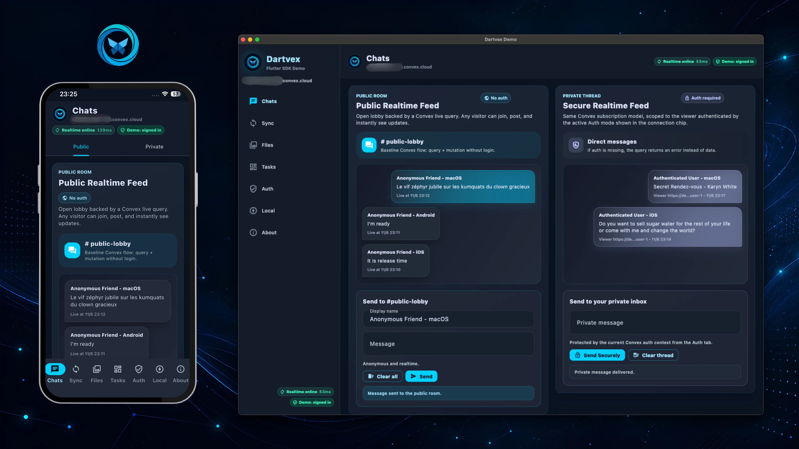

<p align="center">
  
</p>

<h1 align="center">Dartvex</h1>

<p align="center">
  Pure Dart SDK for <a href="https://convex.dev">Convex</a> — real-time sync, type-safe codegen, Flutter widgets, and offline support.
</p>

<p align="center">
  <a href="https://github.com/AndreFrelicot/dartvex/actions/workflows/ci.yml"></a>
  <a href="https://opensource.org/licenses/MIT"></a>
  <a href="https://dart.dev"></a>
  <a href="https://pub.dev/publishers/andrefrelicot.dev/packages"></a>
</p>

<p align="center">
  
</p>

---

## Why Dartvex?

- **Pure Dart** — No Rust FFI, no native bridges. Works everywhere Dart runs.
- **Type-safe codegen** — Generate Dart bindings from your Convex schema. Catch errors at compile time.
- **Flutter widgets** — `ConvexProvider`, `ConvexQuery`, `ConvexMutation` and more for reactive UI.
- **Offline capable** — SQLite query cache and mutation queue with optimistic updates.
- **Multi-platform** — iOS, Android, web, macOS, Linux, Windows.

Web support covers the core realtime client, auth, storage URL resolution, and
Flutter query/mutation widgets. Disk-backed file/image cache and offline image
fallback are native-only because they rely on `dart:io` and local filesystem
storage.

## Quick Start

```dart
import 'package:dartvex/dartvex.dart';

void main() async {
  final client = ConvexClient('https://your-deployment.convex.cloud');

  // Subscribe to a query
  final sub = client.subscribe('messages:list', {});
  sub.stream.listen((result) {
    if (result case QuerySuccess(:final value)) {
      print('Messages: $value');
    }
  });

  // Run a mutation
  await client.mutate('messages:send', {'body': 'Hello from Dart!'});
}
```

## Packages

| Package | Description | Version |
|---------|-------------|---------|
| [`dartvex`](packages/dartvex/) | Core client — WebSocket sync, subscriptions, auth | 0.2.0 |
| [`dartvex_flutter`](packages/dartvex_flutter/) | Flutter widgets — Provider, Query, Mutation | 0.2.0 |
| [`dartvex_codegen`](packages/dartvex_codegen/) | CLI code generator — type-safe Dart bindings from schema | 0.2.0 |
| [`dartvex_local`](packages/dartvex_local/) | Offline support — SQLite cache, mutation queue | 0.2.0 |
| [`dartvex_auth_better`](packages/dartvex_auth_better/) | Better Auth adapter | 0.2.0 |

## Architecture

```text
┌─────────────────────────────────────────────────────────────────────────────┐
│                                  Your App                                   │
├────────────────────────┬──────────────────────┬─────────────────────────────┤
│ dartvex_flutter        │ dartvex_local        │ dartvex_auth_*              │
│ (widgets)              │ (offline)            │ (better auth adapters)      │
├────────────────────────┴──────────────────────┴─────────────────────────────┤
│                                  dartvex                                    │
│                     (core client + WebSocket sync)                          │
├─────────────────────────────────────────────────────────────────────────────┤
│                              Convex Backend                                 │
└─────────────────────────────────────────────────────────────────────────────┘

                              dartvex_codegen
                   (generates typed bindings from schema)
```

## Installation

### 1. Add dependencies

```yaml
# pubspec.yaml
dependencies:
  dartvex: ^0.2.0
  dartvex_flutter: ^0.2.0  # If using Flutter

dev_dependencies:
  dartvex_codegen: ^0.2.0  # For code generation
```

### 2. Configure your client

```dart
import 'package:dartvex/dartvex.dart';
import 'package:dartvex_flutter/dartvex_flutter.dart';

final client = ConvexClient('https://your-deployment.convex.cloud');
final runtime = ConvexClientRuntime(client);

class MyApp extends StatelessWidget {
  @override
  Widget build(BuildContext context) {
    return ConvexProvider(
      client: runtime,
      child: MaterialApp(home: HomePage()),
    );
  }
}
```

### 3. Generate type-safe bindings

```bash
dart run dartvex_codegen generate \
  --spec-file path/to/function_spec.json \
  --output lib/convex_api/
```

### 4. Use in your widgets

```dart
ConvexQuery<List<Message>>(
  query: 'messages:list',
  args: const {},
  decode: (v) => (v as List).map(Message.fromJson).toList(),
  builder: (context, snapshot) {
    if (snapshot.isLoading) return const CircularProgressIndicator();
    if (snapshot.hasError) return Text('Error: ${snapshot.error}');
    final messages = snapshot.data ?? const <Message>[];
    return ListView(children: messages.map(MessageTile.new).toList());
  },
)
```

## Usage Examples

### Queries

```dart
final sub = client.subscribe('tasks:list', {'projectId': 'abc123'});
sub.stream.listen((result) {
  if (result case QuerySuccess(:final value)) {
    print('Tasks: $value');
  }
});
```

### Mutations

```dart
await client.mutate('tasks:create', {
  'title': 'Ship dartvex',
  'projectId': 'abc123',
});
```

### Actions

```dart
final result = await client.action('ai:summarize', {
  'documentId': 'doc456',
});
```

### Authentication

```dart
final authClient = BetterAuthClient(
  baseUrl: 'https://your-deployment.convex.cloud',
);
final provider = ConvexBetterAuthProvider(client: authClient)
  ..email = 'user@example.com'
  ..password = 'securePassword';

final client = ConvexClient('https://your-deployment.convex.cloud');
final authedClient = client.withAuth(provider);
await authedClient.login();
```

### Offline Support

```dart
import 'package:dartvex_local/dartvex_local.dart';

final remoteClient = ConvexClient('https://your-deployment.convex.cloud');
final store = await SqliteLocalStore.open('my_app.sqlite');
final localClient = await ConvexLocalClient.open(
  client: remoteClient,
  config: LocalClientConfig(
    cacheStorage: store,
    queueStorage: store,
    disposeRemoteClient: true,
  ),
);

// Queries served from cache when offline
// Mutations queued and synced when back online
```

The local-first query cache and mutation queue use SQLite and are intended for
native targets. For files on web, resolve signed Convex storage URLs and render
them directly; disk-backed file cache/offline image fallback is not supported on
web in this release.

## Contributing

See [CONTRIBUTING.md](CONTRIBUTING.md) for guidelines.

## License

MIT License - see [LICENSE](LICENSE) for details.
